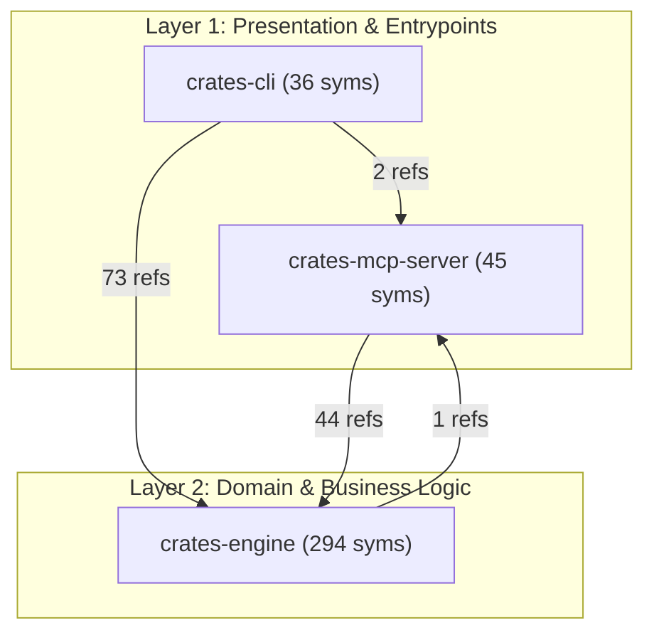

# Repository Architecture & Subsystem Specification

> Automated architectural blueprint generated by [RepoTrim](https://github.com/matinbodaghi/repotrim) using Multiplex Graph Modularity, Topological Layering, and PageRank Centrality.

## 1. Executive Summary & Graph Modularity

| Metric | Value | Architectural Interpretation |
| :--- | :---: | :--- |
| **Analyzed Root** | `.` | Workspace base path |
| **Total AST Symbols** | **375** | Declared functions, methods, structs, classes, types |
| **Multiplex Edges** | **1283** | AST containment, call references, types, imports |
| **Modularity ($Q$)** | **0.192** | High cross-boundary integration |
| **Subsystems Discovered** | **3** | Partitioned architectural communities |

---

## 2. Architectural Dependency Graph

The following diagram illustrates the directed dependency flow between architectural subsystems across all 4 tiers:



---

## 3. Subsystem Community Catalog

| Subsystem | Layer | Root Directory | Symbols | Tokens | Coupling (Out $\to$ In) |
| :--- | :--- | :--- | :---: | :---: | :--- |
| **crates-mcp-server** | `Presentation` | `crates/mcp-server` | 45 | 1074 | crates-engine (44) |
| **crates-cli** | `Presentation` | `crates/cli` | 36 | 1884 | crates-engine (73), crates-mcp-server (2) |
| **crates-engine** | `Domain` | `crates/engine` | 294 | 8756 | crates-mcp-server (1) |

---

## 4. Architectural Layers & Responsibilities

### Layer 1: Presentation & Entrypoints

*Ingress entrypoints, CLI commands, MCP protocol dispatchers, and UI components.*

- **`crates-mcp-server`** (at `crates/mcp-server`): 45 symbols (1074 tokens).
  - Depends on: `crates-engine` (44 refs)
  - Consumed by: `crates-cli` (2 callers), `crates-engine` (1 callers)
- **`crates-cli`** (at `crates/cli`): 36 symbols (1884 tokens).
  - Depends on: `crates-engine` (73 refs), `crates-mcp-server` (2 refs)

### Layer 2: Domain & Business Logic

*Algorithms, solvers, domain models, knapsack optimization, and business logic.*

- **`crates-engine`** (at `crates/engine`): 294 symbols (8756 tokens).
  - Depends on: `crates-mcp-server` (1 refs)
  - Consumed by: `crates-cli` (73 callers), `crates-mcp-server` (44 callers)

---

## 5. Central Architectural Hubs

Symbols with the highest graph centrality (incoming references and stationary PageRank probability). Modifications to these symbols carry high blast radii across the repository:

| Hub Symbol | Kind | Layer | In-Degree | Out-Degree | PageRank Score | Declaring File |
| :--- | :--- | :--- | :---: | :---: | :---: | :--- |
| **`SymbolId`** | `Struct` | `Core` | 66 | 1 | 0.04817 | `crates/engine/src/symbol.rs` |
| **`new`** | `Method` | `Infrastructure` | 59 | 1 | 0.01443 | `crates/engine/src/cache.rs` |
| **`from`** | `Method` | `Domain` | 42 | 1 | 0.04418 | `crates/engine/src/error.rs` |
| **`is_empty`** | `Method` | `Domain` | 38 | 1 | 0.00801 | `crates/engine/src/graph.rs` |
| **`insert`** | `Method` | `Infrastructure` | 38 | 2 | 0.00646 | `crates/engine/src/cache.rs` |
| **`SymbolNode`** | `Struct` | `Core` | 35 | 3 | 0.00760 | `crates/engine/src/symbol.rs` |
| **`MultiplexGraph`** | `Struct` | `Domain` | 34 | 16 | 0.01735 | `crates/engine/src/graph.rs` |
| **`build_graph`** | `Method` | `Infrastructure` | 21 | 4 | 0.00144 | `crates/engine/src/loader.rs` |
| **`build`** | `Method` | `Domain` | 20 | 5 | 0.00202 | `crates/engine/src/graph.rs` |
| **`EngineError`** | `Enum` | `Core` | 16 | 1 | 0.04167 | `crates/engine/src/error.rs` |
| **`default`** | `Method` | `Infrastructure` | 17 | 2 | 0.00357 | `crates/engine/src/cache.rs` |
| **`McpHandler`** | `Struct` | `Presentation` | 15 | 16 | 0.00531 | `crates/mcp-server/src/handler.rs` |
| **`parse_file`** | `Method` | `Domain` | 15 | 5 | 0.00200 | `crates/engine/src/parser.rs` |
| **`symbol`** | `Method` | `Core` | 15 | 3 | 0.00182 | `crates/engine/src/graph.rs` |
| **`FileImport`** | `Struct` | `Domain` | 13 | 2 | 0.01838 | `crates/engine/src/import.rs` |

---

## 6. Public API & Key Interface Catalog

Key exported interfaces and primary data contracts by subsystem:

### Subsystem: `crates-cli`

- **`execute`** (`Function` in `crates/cli/src/commands/architecture.rs`):
```text
pub fn execute(args: ArchitectureArgs) -> Result<(), Box<dyn std::error::Error>>
```

- **`execute`** (`Function` in `crates/cli/src/commands/blueprint.rs`):
```text
pub fn execute(args: BlueprintArgs) -> Result<(), Box<dyn std::error::Error>>
```

- **`execute`** (`Function` in `crates/cli/src/commands/clean.rs`):
```text
pub fn execute(args: CleanArgs) -> Result<(), Box<dyn std::error::Error>>
```

- **`execute`** (`Function` in `crates/cli/src/commands/inspect.rs`):
```text
pub fn execute(args: InspectArgs) -> Result<(), Box<dyn std::error::Error>>
```

- **`execute`** (`Function` in `crates/cli/src/commands/mcp.rs`):
```text
pub fn execute(args: McpArgs) -> Result<(), Box<dyn std::error::Error>>
```

- **`execute`** (`Function` in `crates/cli/src/commands/select.rs`):
```text
pub fn execute(args: SelectArgs) -> Result<(), Box<dyn std::error::Error>>
```

- **`execute`** (`Function` in `crates/cli/src/commands/stats.rs`):
```text
pub fn execute(args: StatsArgs) -> Result<(), Box<dyn std::error::Error>>
```

- **`execute`** (`Function` in `crates/cli/src/commands/watch.rs`):
```text
pub fn execute(args: WatchArgs) -> Result<(), Box<dyn std::error::Error>>
```

- **`generate_blueprint_text`** (`Function` in `crates/cli/src/commands/blueprint.rs`):
> Formats a complete, high-density Markdown feature blueprint.
```text
pub fn generate_blueprint_text(
    task: &str,
    seed_files: &[String],
    symbol_targets: &[(repotrim_engine::SymbolNode, f32)],
    budget: &str,
    model: Option<&str>,
) -> String
```

- **`ArchitectureArgs`** (`Struct` in `crates/cli/src/commands/architecture.rs`):
```text
pub struct ArchitectureArgs {
    /// Target codebase directory to scan
    #[arg(short = 'p', long = "path", default_value = ".")]
    pub path: PathBuf,

    /// Destination file to write architectural documentation (defaults to 'docs/ARCHITECTURE.md', or '-' for stdout)
    #[arg(short = 'o', long = "output", default_value = "docs/ARCHITECTURE.md")]
    pub output: String,

    /// Disable incremental AST caching and force full re-parsing
    #[arg(long = "no-cache")]
    pub no_cache: bool,
}
```

- **`BlueprintArgs`** (`Struct` in `crates/cli/src/commands/blueprint.rs`):
```text
pub struct BlueprintArgs {
    /// Task or feature description to scaffold (e.g. "Add user session authentication")
    pub task: String,

    /// Target codebase directory to scan
    #[arg(short = 'p', long = "path", default_value = ".")]
    pub path: PathBuf,

    /// Recommended token budget for context slicing, or 'auto' for Knee-Curve tuning
    #[arg(short = 'b', long = "budget", default_value = "3000")]
    pub budget: String,

    /// Target LLM architecture for auto-budgeting presets (e.g. 'claude', 'gpt-4o', 'deepseek', 'ollama')
    #[arg(short = 'm', long = "model")]
    pub model: Option<String>,

    /// Destination file to write blueprint (defaults to 'FEATURE_BLUEPRINT.md', or '-' for stdout)
    #[arg(short = 'o', long = "output", default_value = "FEATURE_BLUEPRINT.md")]
    pub output: String,

    /// Disable incremental AST caching and force full re-parsing
    #[arg(long = "no-cache")]
    pub no_cache: bool,
}
```

- **`CleanArgs`** (`Struct` in `crates/cli/src/commands/clean.rs`):
```text
pub struct CleanArgs {
    /// Target codebase directory containing .repotrim cache
    #[arg(short = 'p', long = "path", default_value = ".")]
    pub path: PathBuf,
}
```

- **`Cli`** (`Struct` in `crates/cli/src/main.rs`):
```text
struct Cli {
    #[command(subcommand)]
    command: Commands,
}
```

- **`InspectArgs`** (`Struct` in `crates/cli/src/commands/inspect.rs`):
```text
pub struct InspectArgs {
    /// Name of the symbol to inspect
    #[arg(short = 's', long = "symbol", required = true)]
    pub symbol: String,

    /// Target codebase directory to scan
    #[arg(short = 'p', long = "path", default_value = ".")]
    pub path: PathBuf,

    /// Disable incremental AST caching and force full re-parsing
    #[arg(long = "no-cache")]
    pub no_cache: bool,
}
```

- **`McpArgs`** (`Struct` in `crates/cli/src/commands/mcp.rs`):
```text
pub struct McpArgs {
    /// Default codebase directory to serve over Model Context Protocol
    #[arg(short = 'p', long = "path", default_value = ".")]
    pub path: PathBuf,
}
```

- **`SelectArgs`** (`Struct` in `crates/cli/src/commands/select.rs`):
```text
pub struct SelectArgs {
    /// One or more seed symbol identifiers (functions, methods, structs, traits)
    #[arg(short = 's', long = "seed")]
    pub seed: Vec<String>,

    /// Natural language intent, query terms, or error message to automatically infer seeds
    #[arg(short = 'q', long = "query")]
    pub query: Option<String>,

    /// Automatically infer seeds from current git diff (staged and unstaged changes)
    #[arg(long = "from-diff")]
    pub from_diff: bool,

    /// Maximum token budget for selected context, or 'auto' for Knee-Curve tuning
    #[arg(short = 'b', long = "budget", default_value = "1000")]
    pub budget: String,

    /// Target LLM architecture for auto-budgeting presets (e.g. 'claude', 'gpt-4o', 'deepseek', 'ollama')
    #[arg(short = 'm', long = "model")]
    pub model: Option<String>,

    /// Target codebase directory to scan
    #[arg(short = 'p', long = "path", default_value = ".")]
    pub path: PathBuf,

    /// Output serialization format (markdown or json)
    #[arg(short = 'f', long = "format", value_enum, default_value_t = OutputFormat::Markdown)]
    pub format: OutputFormat,

    /// Disable incremental AST caching and force full re-parsing
    #[arg(long = "no-cache")]
    pub no_cache: bool,

    /// Optional file destination to write output (defaults to stdout)
    #[arg(short = 'o', long = "output")]
    pub output: Option<PathBuf>,
}
```

- **`StatsArgs`** (`Struct` in `crates/cli/src/commands/stats.rs`):
```text
pub struct StatsArgs {
    /// Target codebase directory to scan
    #[arg(short = 'p', long = "path", default_value = ".")]
    pub path: PathBuf,

    /// Disable incremental AST caching and force full re-parsing
    #[arg(long = "no-cache")]
    pub no_cache: bool,
}
```

- **`WatchArgs`** (`Struct` in `crates/cli/src/commands/watch.rs`):
```text
pub struct WatchArgs {
    /// Target codebase directory to watch
    #[arg(short = 'p', long = "path", default_value = ".")]
    pub path: PathBuf,

    /// Debounce delay in milliseconds before rebuilding the in-memory graph
    #[arg(short = 'd', long = "debounce", default_value = "75")]
    pub debounce: u64,
}
```

- **`Commands`** (`Enum` in `crates/cli/src/main.rs`):
```text
enum Commands {
    /// Select mathematically optimal code context for AI prompts
    Select(commands::select::SelectArgs),
    /// Generate a structured feature blueprint with inferred seed anchors for agent harnesses
    Blueprint(commands::blueprint::BlueprintArgs),
    /// Generate evergreen repository architectural specification and Mermaid diagrams
    Architecture(commands::architecture::ArchitectureArgs),
    /// Display repository graph statistics and central architectural hubs
    Stats(commands::stats::StatsArgs),
    /// Deeply inspect a symbol's graph dependencies and callers
    Inspect(commands::inspect::InspectArgs),
    /// Clear incremental AST Merkle cache (.repotrim directory)
    Clean(commands::clean::CleanArgs),
    /// Run Model Context Protocol (MCP) server over stdio for AI agent harnesses
    Mcp(commands::mcp::McpArgs),
    /// Watch codebase for file changes and incrementally maintain the in-memory graph
    Watch(commands::watch::WatchArgs),
}
```

- **`OutputFormat`** (`Enum` in `crates/cli/src/commands/select.rs`):
```text
pub enum OutputFormat {
    Markdown,
    Json,
}
```

### Subsystem: `crates-engine`

- **`compute_blake3_hash`** (`Function` in `crates/engine/src/cache.rs`):
> Computes the 32-byte BLAKE3 cryptographic hash of a byte slice.
```text
pub fn compute_blake3_hash(bytes: &[u8]) -> [u8; 32]
```

- **`compute_path_distance`** (`Function` in `crates/engine/src/resolver.rs`):
> Computes the relative module/path distance between two file paths.
```text
pub fn compute_path_distance(p1: &Path, p2: &Path) -> usize
```

- **`estimate_tokens`** (`Function` in `crates/engine/src/tokens.rs`):
> Estimates the token count of a given text using a fast BPE heuristic.
```text
pub fn estimate_tokens(text: &str) -> usize
```

- **`get_mtime_nanos`** (`Function` in `crates/engine/src/cache.rs`):
> Extracts file modification time as nanoseconds since UNIX epoch.
```text
pub fn get_mtime_nanos(metadata: &fs::Metadata) -> u128
```

- **`is_ignored_path`** (`Function` in `crates/engine/src/watcher.rs`):
> Inspects whether a given path is located within an ignored directory (e.g. .git, target).
```text
pub fn is_ignored_path(path: &Path, root: &Path) -> bool
```

- **`normalize_path`** (`Function` in `crates/engine/src/import.rs`):
> Normalizes a path by resolving `.` and `..` components logically.
```text
pub fn normalize_path(path: &Path) -> PathBuf
```

- **`resolve_module_path`** (`Function` in `crates/engine/src/import.rs`):
> Resolves a raw module specifier to an exact relative file path in the known workspace.
```text
pub fn resolve_module_path(
    source_file: &Path,
    module_specifier: &str,
    known_files: &HashSet<PathBuf>,
    lang: SupportedLanguage,
) -> Option<PathBuf>
```

- **`analyze`** (`Method` in `crates/engine/src/architecture.rs`):
> Analyzes the repository's `MultiplexGraph` to discover architectural subsystems,
```text
pub fn analyze(graph: &MultiplexGraph, root_path: &Path) -> Self
```

- **`assign_lod`** (`Method` in `crates/engine/src/formatter.rs`):
> Dynamically allocates Level-of-Detail (LOD) to selected symbols based on seed proximity,
```text
pub fn assign_lod(
        symbols: &[SymbolNode],
        ppr_scores: &HashMap<SymbolId, f32>,
        seed_ids: &[SymbolId],
        budget: usize,
        file_sources: &HashMap<PathBuf, String>,
    ) -> HashMap<SymbolId, LodLevel>
```

- **`build`** (`Method` in `crates/engine/src/graph.rs`):
> Constructs a `MultiplexGraph` from extracted symbols, raw reference edges, and layer weights.
```text
pub fn build(
        symbols: Vec<SymbolNode>,
        raw_edges: &[ReferenceEdge],
        weights: LayerWeights,
    ) -> Self
```

---

## References & Mathematical Attribution

- **Newman-Girvan Modularity:** Newman, M. E., & Girvan, M. (2004). *"Finding and evaluating community structure in networks."* Physical Review E, 69(2), 026113.
- **Louvain Method:** Blondel, V. D. et al. (2008). *"Fast unfolding of communities in large networks."* J. Stat. Mech., P10008.
- **Software Architecture Reconstruction:** Ducasse, S., & Pollet, D. (2009). *"Software Architecture Reconstruction: A Process-Oriented Taxonomy."* IEEE TSE, 35(4), 573–591.
