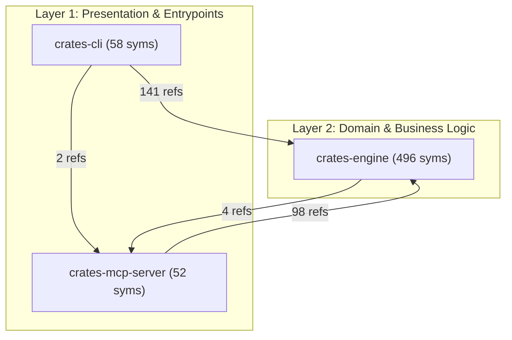

# Repository Architecture & Subsystem Specification

> Automated architectural blueprint generated by [RepoTrim](https://github.com/matinbodaghi/repotrim) using Multiplex Graph Modularity, Topological Layering, and PageRank Centrality.

## 1. Executive Summary & Graph Modularity

| Metric | Value | Architectural Interpretation |
| :--- | :---: | :--- |
| **Analyzed Root** | `.` | Workspace base path |
| **Total AST Symbols** | **606** | Declared functions, methods, structs, classes, types |
| **Multiplex Edges** | **2432** | AST containment, call references, types, imports |
| **Modularity ($Q$)** | **0.142** | High cross-boundary integration |
| **Subsystems Discovered** | **3** | Partitioned architectural communities |

---

## 2. Architectural Dependency Graph

The following diagram illustrates the directed dependency flow between architectural subsystems across all 4 tiers:



---

## 3. Subsystem Community Catalog

| Subsystem | Layer | Root Directory | Symbols | Tokens | Coupling (Out $\to$ In) |
| :--- | :--- | :--- | :---: | :---: | :--- |
| **crates-cli** | `Presentation` | `crates/cli` | 58 | 3707 | crates-engine (141), crates-mcp-server (2) |
| **crates-mcp-server** | `Presentation` | `crates/mcp-server` | 52 | 1189 | crates-engine (98) |
| **crates-engine** | `Domain` | `crates/engine` | 496 | 16783 | crates-mcp-server (4) |

---

## 4. Architectural Layers & Responsibilities

### Layer 1: Presentation & Entrypoints

*Ingress entrypoints, CLI commands, MCP protocol dispatchers, and UI components.*

- **`crates-cli`** (at `crates/cli`): 58 symbols (3707 tokens).
  - Depends on: `crates-engine` (141 refs), `crates-mcp-server` (2 refs)
- **`crates-mcp-server`** (at `crates/mcp-server`): 52 symbols (1189 tokens).
  - Depends on: `crates-engine` (98 refs)
  - Consumed by: `crates-cli` (2 callers), `crates-engine` (4 callers)

### Layer 2: Domain & Business Logic

*Algorithms, solvers, domain models, knapsack optimization, and business logic.*

- **`crates-engine`** (at `crates/engine`): 496 symbols (16783 tokens).
  - Depends on: `crates-mcp-server` (4 refs)
  - Consumed by: `crates-cli` (141 callers), `crates-mcp-server` (98 callers)

---

## 5. Central Architectural Hubs

Symbols with the highest graph centrality (incoming references and stationary PageRank probability). Modifications to these symbols carry high blast radii across the repository:

| Hub Symbol | Kind | Layer | In-Degree | Out-Degree | PageRank Score | Declaring File |
| :--- | :--- | :--- | :---: | :---: | :---: | :--- |
| **`SymbolId`** | `Struct` | `Core` | 147 | 1 | 0.06986 | `crates/engine/src/symbol.rs` |
| **`new`** | `Method` | `Infrastructure` | 112 | 1 | 0.01408 | `crates/engine/src/cache.rs` |
| **`insert`** | `Method` | `Infrastructure` | 75 | 2 | 0.00650 | `crates/engine/src/cache.rs` |
| **`from`** | `Method` | `Domain` | 70 | 1 | 0.04223 | `crates/engine/src/error.rs` |
| **`MultiplexGraph`** | `Struct` | `Domain` | 63 | 18 | 0.00923 | `crates/engine/src/graph.rs` |
| **`SymbolNode`** | `Struct` | `Core` | 63 | 3 | 0.00696 | `crates/engine/src/symbol.rs` |
| **`as_str`** | `Method` | `Domain` | 50 | 1 | 0.01112 | `crates/engine/src/impact.rs` |
| **`build`** | `Method` | `Domain` | 47 | 5 | 0.00160 | `crates/engine/src/graph.rs` |
| **`is_empty`** | `Method` | `Domain` | 44 | 1 | 0.00601 | `crates/engine/src/coedit.rs` |
| **`default`** | `Method` | `Infrastructure` | 41 | 2 | 0.00349 | `crates/engine/src/cache.rs` |
| **`new`** | `Method` | `Domain` | 34 | 1 | 0.02053 | `crates/engine/src/symbol.rs` |
| **`symbol`** | `Method` | `Core` | 28 | 3 | 0.00127 | `crates/engine/src/graph.rs` |
| **`build_graph`** | `Method` | `Infrastructure` | 24 | 4 | 0.00093 | `crates/engine/src/loader.rs` |
| **`EngineError`** | `Enum` | `Core` | 20 | 1 | 0.03919 | `crates/engine/src/error.rs` |
| **`repo_root`** | `Function` | `Presentation` | 23 | 1 | 0.00389 | `crates/cli/tests/cli_test.rs` |

---

## 6. Public API & Key Interface Catalog

Key exported interfaces and primary data contracts by subsystem:

### Subsystem: `crates-cli`

- **`execute`** (`Function` in `crates/cli/src/commands/architecture.rs`):
```text
pub fn execute(args: ArchitectureArgs) -> Result<(), Box<dyn std::error::Error>>
```

- **`execute`** (`Function` in `crates/cli/src/commands/blueprint.rs`):
```text
pub fn execute(args: BlueprintArgs) -> Result<(), Box<dyn std::error::Error>>
```

- **`execute`** (`Function` in `crates/cli/src/commands/clean.rs`):
```text
pub fn execute(args: CleanArgs) -> Result<(), Box<dyn std::error::Error>>
```

- **`execute`** (`Function` in `crates/cli/src/commands/coedit.rs`):
```text
pub fn execute(args: CoeditArgs) -> Result<(), Box<dyn std::error::Error>>
```

- **`execute`** (`Function` in `crates/cli/src/commands/community.rs`):
```text
pub fn execute(args: CommunityArgs) -> Result<(), Box<dyn std::error::Error>>
```

- **`execute`** (`Function` in `crates/cli/src/commands/impact.rs`):
```text
pub fn execute(args: ImpactArgs) -> Result<(), Box<dyn std::error::Error>>
```

- **`execute`** (`Function` in `crates/cli/src/commands/inspect.rs`):
```text
pub fn execute(args: InspectArgs) -> Result<(), Box<dyn std::error::Error>>
```

- **`execute`** (`Function` in `crates/cli/src/commands/mcp.rs`):
```text
pub fn execute(args: McpArgs) -> Result<(), Box<dyn std::error::Error>>
```

- **`execute`** (`Function` in `crates/cli/src/commands/select.rs`):
```text
pub fn execute(args: SelectArgs) -> Result<(), Box<dyn std::error::Error>>
```

- **`execute`** (`Function` in `crates/cli/src/commands/stats.rs`):
```text
pub fn execute(args: StatsArgs) -> Result<(), Box<dyn std::error::Error>>
```

- **`execute`** (`Function` in `crates/cli/src/commands/watch.rs`):
```text
pub fn execute(args: WatchArgs) -> Result<(), Box<dyn std::error::Error>>
```

- **`generate_blueprint_text`** (`Function` in `crates/cli/src/commands/blueprint.rs`):
> Formats a complete, high-density Markdown feature blueprint.
```text
pub fn generate_blueprint_text(
    task: &str,
    seed_files: &[String],
    symbol_targets: &[(repotrim_engine::SymbolNode, f32)],
    budget: &str,
    model: Option<&str>,
    tokenizer: Option<&str>,
) -> String
```

- **`ArchitectureArgs`** (`Struct` in `crates/cli/src/commands/architecture.rs`):
```text
pub struct ArchitectureArgs {
    /// Target codebase directory to scan
    #[arg(short = 'p', long = "path", default_value = ".")]
    pub path: PathBuf,

    /// Destination file to write architectural documentation (defaults to 'docs/ARCHITECTURE.md', or '-' for stdout)
    #[arg(short = 'o', long = "output", default_value = "docs/ARCHITECTURE.md")]
    pub output: String,

    /// Disable incremental AST caching and force full re-parsing
    #[arg(long = "no-cache")]
    pub no_cache: bool,

    /// Modularity resolution parameter gamma for subsystem community detection
    #[arg(short = 'r', long = "resolution", default_value = "1.0")]
    pub resolution: f64,
}
```

- **`BlueprintArgs`** (`Struct` in `crates/cli/src/commands/blueprint.rs`):
```text
pub struct BlueprintArgs {
    /// Task or feature description to scaffold (e.g. "Add user session authentication")
    pub task: String,

    /// Target codebase directory to scan
    #[arg(short = 'p', long = "path", default_value = ".")]
    pub path: PathBuf,

    /// Recommended token budget for context slicing, or 'auto' for Knee-Curve tuning
    #[arg(short = 'b', long = "budget", default_value = "3000")]
    pub budget: String,

    /// Target LLM architecture for auto-budgeting presets (e.g. 'claude', 'gpt-4o', 'deepseek', 'ollama')
    #[arg(short = 'm', long = "model")]
    pub model: Option<String>,

    /// Tokenizer model for recommended token budgeting ('fast', 'calibrated', 'exact' / 'cl100k', 'o200k')
    #[arg(long = "tokenizer", default_value = "fast")]
    pub tokenizer: String,

    /// Destination file to write blueprint (defaults to 'FEATURE_BLUEPRINT.md', or '-' for stdout)
    #[arg(short = 'o', long = "output", default_value = "FEATURE_BLUEPRINT.md")]
    pub output: String,

    /// Disable incremental AST caching and force full re-parsing
    #[arg(long = "no-cache")]
    pub no_cache: bool,

    /// Include mined Git commit co-edits in seed identification and blueprint scaffolding
    #[arg(long = "coedit", alias = "use-coedit")]
    pub coedit: bool,
}
```

- **`CleanArgs`** (`Struct` in `crates/cli/src/commands/clean.rs`):
```text
pub struct CleanArgs {
    /// Target codebase directory containing .repotrim cache
    #[arg(short = 'p', long = "path", default_value = ".")]
    pub path: PathBuf,
}
```

- **`Cli`** (`Struct` in `crates/cli/src/main.rs`):
```text
struct Cli {
    #[command(subcommand)]
    command: Commands,
}
```

- **`CoeditArgs`** (`Struct` in `crates/cli/src/commands/coedit.rs`):
```text
pub struct CoeditArgs {
    /// Target codebase directory to scan
    #[arg(short = 'p', long = "path", default_value = ".")]
    pub path: PathBuf,

    /// Maximum number of historical commits to inspect from HEAD
    #[arg(long = "max-commits", default_value = "200")]
    pub max_commits: usize,

    /// Half-life in days for exponential recency decay
    #[arg(long = "half-life-days", default_value = "90.0")]
    pub half_life_days: f64,

    /// Maximum files per commit before classifying as bulk megacommit noise
    #[arg(long = "max-files", default_value = "25")]
    pub max_files: usize,

    /// Maximum symbols per commit before classifying as megacommit noise
    #[arg(long = "max-symbols", default_value = "40")]
    pub max_symbols: usize,

    /// Minimum raw co-edit occurrences required to consider two symbols logically coupled
    #[arg(long = "min-support", default_value = "2")]
    pub min_support: usize,

    /// Minimum association confidence threshold
    #[arg(long = "min-confidence", default_value = "0.15")]
    pub min_confidence: f32,

    /// Minimum Jaccard similarity threshold
    #[arg(long = "min-jaccard", default_value = "0.05")]
    pub min_jaccard: f32,

    /// Disable cache and force re-mining Git history
    #[arg(long = "no-cache")]
    pub no_cache: bool,

    /// Output results in machine-readable JSON format
    #[arg(long = "json")]
    pub json: bool,
}
```

- **`CommunityArgs`** (`Struct` in `crates/cli/src/commands/community.rs`):
```text
pub struct CommunityArgs {
    /// Target codebase directory to scan
    #[arg(short = 'p', long = "path", default_value = ".")]
    pub path: PathBuf,

    /// Modularity resolution parameter gamma (Reichardt & Bornholdt, 2004)
    #[arg(short = 'r', long = "resolution", default_value = "1.0")]
    pub resolution: f64,

    /// Display multi-resolution hierarchy (Macro gamma=0.5, Meso gamma=1.0, Micro gamma=2.5)
    #[arg(long = "hierarchy")]
    pub hierarchy: bool,

    /// Identify architectural drift and misplaced / leaky symbols
    #[arg(long = "drift")]
    pub drift: bool,

    /// Disable incremental AST caching and force full re-parsing
    #[arg(long = "no-cache")]
    pub no_cache: bool,

    /// Output results in machine-readable JSON format
    #[arg(long = "json")]
    pub json: bool,
}
```

- **`CommunityCliReport`** (`Struct` in `crates/cli/src/commands/community.rs`):
```text
struct CommunityCliReport {
    resolution: f64,
    modularity: f32,
    total_symbols: usize,
    community_count: usize,
    communities: Vec<Community>,
    #[serde(skip_serializing_if = "Option::is_none")]
    drift: Option<Vec<ArchitecturalDrift>>,
    #[serde(skip_serializing_if = "Option::is_none")]
    hierarchy: Option<CommunityHierarchy>,
}
```

- **`ImpactArgs`** (`Struct` in `crates/cli/src/commands/impact.rs`):
```text
pub struct ImpactArgs {
    /// Target symbol name to evaluate blast radius for
    #[arg(short = 's', long = "symbol")]
    pub symbol: Option<String>,

    /// Infer modified symbols from uncommitted git changes (default if no symbol specified)
    #[arg(long = "diff")]
    pub diff: bool,

    /// Optional git revision or branch to diff against (e.g. 'origin/main', 'HEAD~1')
    #[arg(long = "diff-against")]
    pub diff_against: Option<String>,

    /// Maximum token budget for blast radius context outline
    #[arg(short = 'b', long = "budget", default_value = "1000")]
    pub budget: String,

    /// Tokenizer model for blast radius token budgeting ('fast', 'calibrated', 'exact' / 'cl100k', 'o200k')
    #[arg(long = "tokenizer", default_value = "fast")]
    pub tokenizer: String,

    /// Output serialization format (markdown or json)
    #[arg(long = "format", default_value = "markdown")]
    pub format: String,

    /// Target codebase directory to scan
    #[arg(short = 'p', long = "path", default_value = ".")]
    pub path: PathBuf,

    /// Disable incremental AST caching and force full re-parsing
    #[arg(long = "no-cache")]
    pub no_cache: bool,
}
```

- **`InspectArgs`** (`Struct` in `crates/cli/src/commands/inspect.rs`):
```text
pub struct InspectArgs {
    /// Name of the symbol to inspect
    #[arg(short = 's', long = "symbol", required = true)]
    pub symbol: String,

    /// Target codebase directory to scan
    #[arg(short = 'p', long = "path", default_value = ".")]
    pub path: PathBuf,

    /// Disable incremental AST caching and force full re-parsing
    #[arg(long = "no-cache")]
    pub no_cache: bool,
}
```

- **`McpArgs`** (`Struct` in `crates/cli/src/commands/mcp.rs`):
```text
pub struct McpArgs {
    /// Default codebase directory to serve over Model Context Protocol
    #[arg(short = 'p', long = "path", default_value = ".")]
    pub path: PathBuf,
}
```

- **`SelectArgs`** (`Struct` in `crates/cli/src/commands/select.rs`):
```text
pub struct SelectArgs {
    /// One or more seed symbol identifiers (functions, methods, structs, traits)
    #[arg(short = 's', long = "seed")]
    pub seed: Vec<String>,

    /// Natural language intent, query terms, or error message to automatically infer seeds
    #[arg(short = 'q', long = "query")]
    pub query: Option<String>,

    /// Automatically infer seeds from current git diff (staged and unstaged changes)
    #[arg(long = "from-diff")]
    pub from_diff: bool,

    /// Maximum token budget for selected context, or 'auto' for Knee-Curve tuning
    #[arg(short = 'b', long = "budget", default_value = "1000")]
    pub budget: String,

    /// Target LLM architecture for auto-budgeting presets (e.g. 'claude', 'gpt-4o', 'deepseek', 'ollama')
    #[arg(short = 'm', long = "model")]
    pub model: Option<String>,

    /// Tokenizer model for token budgeting ('fast', 'calibrated', 'exact' / 'cl100k', 'o200k')
    #[arg(long = "tokenizer", default_value = "fast")]
    pub tokenizer: String,

    /// Target codebase directory to scan
    #[arg(short = 'p', long = "path", default_value = ".")]
    pub path: PathBuf,

    /// Output serialization format (markdown or json)
    #[arg(short = 'f', long = "format", value_enum, default_value_t = OutputFormat::Markdown)]
    pub format: OutputFormat,

    /// Disable incremental AST caching and force full re-parsing
    #[arg(long = "no-cache")]
    pub no_cache: bool,

    /// Optional file destination to write output (defaults to stdout)
    #[arg(short = 'o', long = "output")]
    pub output: Option<PathBuf>,

    /// Display numerical stability diagnostics and knapsack sensitivity analysis
    #[arg(long = "diagnostics", alias = "sensitivity")]
    pub diagnostics: bool,

    /// Enable Multiple-Choice Knapsack (MCKP) joint symbol selection and Level-of-Detail (LOD) optimization
    #[arg(long = "joint-lod", alias = "mckp")]
    pub joint_lod: bool,

    /// Include mined Git commit co-edit logical coupling edges in the multiplex graph
    #[arg(long = "coedit", alias = "use-coedit")]
    pub coedit: bool,

    /// Dynamically calibrate multiplex layer weights using empirical Git commit history
    #[arg(long = "learn-weights", alias = "learned-weights")]
    pub learn_weights: bool,

    /// Apply intra-community cohesion boost to focus seeds to reduce external hub drift
    #[arg(long = "community-boost", alias = "community", default_value = "0.0")]
    pub community_boost: f32,
}
```

- **`StatsArgs`** (`Struct` in `crates/cli/src/commands/stats.rs`):
```text
pub struct StatsArgs {
    /// Target codebase directory to scan
    #[arg(short = 'p', long = "path", default_value = ".")]
    pub path: PathBuf,

    /// Disable incremental AST caching and force full re-parsing
    #[arg(long = "no-cache")]
    pub no_cache: bool,
}
```

- **`WatchArgs`** (`Struct` in `crates/cli/src/commands/watch.rs`):
```text
pub struct WatchArgs {
    /// Target codebase directory to watch
    #[arg(short = 'p', long = "path", default_value = ".")]
    pub path: PathBuf,

    /// Debounce delay in milliseconds before rebuilding the in-memory graph
    #[arg(short = 'd', long = "debounce", default_value = "75")]
    pub debounce: u64,
}
```

- **`Commands`** (`Enum` in `crates/cli/src/main.rs`):
```text
enum Commands {
    /// Select mathematically optimal code context for AI prompts
    Select(commands::select::SelectArgs),
    /// Generate a structured feature blueprint with inferred seed anchors for agent harnesses
    Blueprint(commands::blueprint::BlueprintArgs),
    /// Generate evergreen repository architectural specification and Mermaid diagrams
    Architecture(commands::architecture::ArchitectureArgs),
    /// Display repository graph statistics and central architectural hubs
    Stats(commands::stats::StatsArgs),
    /// Deeply inspect a symbol's graph dependencies and callers
    Inspect(commands::inspect::InspectArgs),
    /// Clear incremental AST Merkle cache (.repotrim directory)
    Clean(commands::clean::CleanArgs),
    /// Trace semantic blast radius, ripple effects, and affected test targets of code changes
    Impact(commands::impact::ImpactArgs),
    /// Mine historical Git co-edits and learn empirical multiplex layer edge weights
    Coedit(commands::coedit::CoeditArgs),
    /// Detect multi-resolution topological communities, hierarchy, and architectural drift
    Community(commands::community::CommunityArgs),
    /// Run Model Context Protocol (MCP) server over stdio for AI agent harnesses
    Mcp(commands::mcp::McpArgs),
    /// Watch codebase for file changes and incrementally maintain the in-memory graph
    Watch(commands::watch::WatchArgs),
}
```

- **`OutputFormat`** (`Enum` in `crates/cli/src/commands/select.rs`):
```text
pub enum OutputFormat {
    Markdown,
    Json,
}
```

### Subsystem: `crates-engine`

- **`build_pareto_frontier`** (`Function` in `crates/engine/src/celf.rs`):
> Builds the Pareto-efficient upper convex hull of Level-of-Detail options for a symbol.
```text
pub fn build_pareto_frontier(
    sym: &SymbolNode,
    file_source: Option<&str>,
    model: TokenizerModel,
    weights: LodWeights,
) -> Vec<LodOption>
```

- **`compute_blake3_hash`** (`Function` in `crates/engine/src/cache.rs`):
> Computes the 32-byte BLAKE3 cryptographic hash of a byte slice.
```text
pub fn compute_blake3_hash(bytes: &[u8]) -> [u8; 32]
```

- **`compute_path_distance`** (`Function` in `crates/engine/src/resolver.rs`):
> Computes the relative module/path distance between two file paths.
```text
pub fn compute_path_distance(p1: &Path, p2: &Path) -> usize
```

---

## References & Mathematical Attribution

- **Newman-Girvan Modularity:** Newman, M. E., & Girvan, M. (2004). *"Finding and evaluating community structure in networks."* Physical Review E, 69(2), 026113.
- **Louvain Method:** Blondel, V. D. et al. (2008). *"Fast unfolding of communities in large networks."* J. Stat. Mech., P10008.
- **Software Architecture Reconstruction:** Ducasse, S., & Pollet, D. (2009). *"Software Architecture Reconstruction: A Process-Oriented Taxonomy."* IEEE TSE, 35(4), 573–591.
