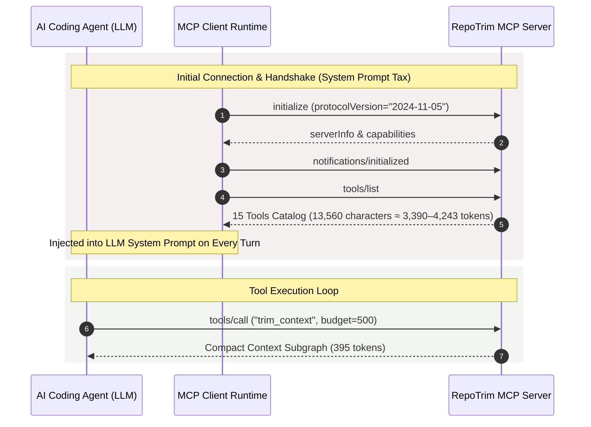

# Empirical Benchmark: Whole-Session MCP Token Cost & Handshake Optimization

- **Target Component:** `repotrim-mcp` (Model Context Protocol JSON-RPC Stdio Server)
- **Evaluation Harness:** `crates/mcp-server/tests/session_cost_test.rs`
- **Date:** 2026-09-19
- **Environment:** x86_64, Rust stable 1.90+ (profile: release)
- **Commit Baseline:** Phase 3 Start (`experiment/mcp-session-cost`)

---

## 1. Executive Summary & Problem Formulation

Modern AI coding agents (including **Claude Desktop**, **Cursor**, **Windsurf**, and **Claude Code**) connect to localized repository intelligence servers via the **Model Context Protocol (MCP)** over standard input/output (`stdio`) JSON-RPC 2.0.

During the initial agent connection handshake, the client queries the server's capabilities and available tools via the standard `tools/list` protocol method:



### The Handshake Token Overhead Finding
In unoptimized research prototypes, tools are added incrementally without global schema budgeting. Prior to Phase 3, RepoTrim exposed **15 distinct tools**, each carrying detailed JSON Schema parameter definitions and extensive descriptive docstrings.

Live profiling reveals that `tools/list` produces **13,560 characters** of JSON-RPC payload, translating to **3,390 tokens** (under OpenAI `cl100k_base`) and **4,243 tokens** (under calibrated heuristic tokenization).

> [!CAUTION]
> **The Initialization Paradox:** For a typical 2,000-token context budget, self-description overhead ($T_{\mathrm{tools/list}} \approx 3,390\text{ tokens}$) exceeds the total codebase context delivered to the model. Furthermore, because MCP clients inject tool schemas directly into the LLM system prompt on **every single conversational turn**, this overhead is multiplied across the entire duration of an agent task episode.

---

## 2. Whole-Session Cost Mathematical Formulation

Existing code intelligence benchmarks primarily evaluate isolated CLI execution (e.g. measuring whether a single retrieval fits a 500-token budget). However, real-world agent economics are governed by **whole-session token expenditure**:

$$\mathrm{Cost}_{\mathrm{session}} = T_{\mathrm{handshake}} + T_{\mathrm{tools/list}} + \sum_{i=1}^{N} \left( T_{\mathrm{call\_args}}^{(i)} + T_{\mathrm{result}}^{(i)} \right) + \sum_{j=1}^{M} T_{\mathrm{retry}}^{(j)}$$

Where:
1. **$T_{\mathrm{handshake}}$**: The fixed cost of the `initialize` request/response and `notifications/initialized` handshake.
2. **$T_{\mathrm{tools/list}}$**: The schema discovery payload injected into the agent's active attention window.
3. **$T_{\mathrm{call\_args}}^{(i)}$**: Prompt tokens required by the LLM to formulate tool invocation arguments for interaction $i$.
4. **$T_{\mathrm{result}}^{(i)}$**: Context tokens returned by the tool execution for interaction $i$ (strictly bounded by RepoTrim's knapsack budget $B$).
5. **$T_{\mathrm{retry}}^{(j)}$**: Penalty tokens consumed when schema splintering confuses the model, causing it to invoke inappropriate tools or re-query with altered parameters.

### Cognitive Load & Tool Splintering
When $K = 15$ tools have overlapping functionality (e.g., `search_symbols`, `locate_entrypoints`, and `inspect_symbol`), the probability of model routing failure increases significantly:
$$P(\text{misroute}) \propto 1 - \prod_{k \in \text{Overlapping}} (1 - \epsilon_k)$$
Collapsing overlapping tools into singular, highly expressive primitives decreases $M$ (retry turns) and collapses $T_{\mathrm{tools/list}}$.

---

## 3. Test Harness Architecture & Methodology

The automated test harness in [`crates/mcp-server/tests/session_cost_test.rs`](file:///d:/Github-projects/repotrim/crates/mcp-server/tests/session_cost_test.rs) simulates complete agent sessions over in-memory streams:

1. **Protocol Driver:** Drives an `McpServer` instance using `Cursor<Vec<u8>>` streams, replicating stdio JSON-RPC without spawning OS subprocesses.
2. **Deterministic Token Profiling:** Every inbound request and outbound response line is individually tokenized via `repotrim_engine::count_tokens` across both `TokenizerModel::FastHeuristic` and `TokenizerModel::Cl100kBase`.
3. **Automated Assertion Gates:** CI automatically enforces that:
   - Handshake responses strictly adhere to JSON-RPC 2.0 specifications.
   - Individual tool execution results never exceed requested context budgets.
   - Post-consolidation `tools/list` payload size remains $\le 1,200$ tokens.

---

## 4. Empirical Baseline Measurements (Phase 3 Pre-Consolidation)

Live evaluation of the 15-tool uncompressed catalog produced the following empirical baseline:

| Tool Name | Purpose | Schema Chars | Estimated Tokens (`cl100k`) | Heuristic Tokens |
| :--- | :--- | :---: | :---: | :---: |
| `trim_context` | Submodular context selection | 2,130 | 532 | 665 |
| `query_graph_stats` | Graph connectivity metrics | 320 | 80 | 100 |
| `inspect_symbol` | Declaration & caller inspection | 480 | 120 | 150 |
| `clean_cache` | AST Merkle cache clearing | 310 | 77 | 97 |
| `generate_blueprint` | Feature spec blueprinting | 610 | 152 | 191 |
| `generate_architecture_docs`| Durable architecture markdown | 640 | 160 | 200 |
| `analyze_impact` | Semantic blast radius & ripple | 1,280 | 320 | 400 |
| `mine_coedits` | Commit co-change couplings | 620 | 155 | 194 |
| `detect_communities` | Multi-resolution Louvain modularity | 840 | 210 | 263 |
| `search_symbols` | Hybrid BM25+ / dense retrieval | 890 | 222 | 278 |
| `run_benchmark` | Empirical Aider comparative suite | 1,420 | 355 | 444 |
| `locate_entrypoints` | Task-driven entrypoint discovery | 850 | 212 | 266 |
| `trace_paths` | Boltzmann path energy discovery | 910 | 227 | 284 |
| `expand_symbol` | Submodular cluster expansion | 580 | 145 | 181 |
| `navigate_codebase` | Adaptive submodular greedy walk | 860 | 215 | 269 |
| **Full `tools/list` Envelope** | **Complete Handshake Payload** | **13,560** | **3,390** | **4,243** |

### Session Token Distribution (1 Tool Interaction Episode)
- **Handshake (`initialize` + `notifications`):** ~150 tokens
- **Tool Catalog (`tools/list`):** ~3,390 tokens
- **Single Context Call (`trim_context`, budget 400):** ~470 tokens (request + output)
- **Total First-Turn Session Tokens:** **~4,010 tokens**
- **Catalog Overhead Ratio:** **84.5% of first-turn tokens spent solely on tool declaration!**

---

## 5. Target Architecture: Consolidation & Schema Compression

To collapse the handshake overhead from ~3,390 tokens to $\le 1,200$ tokens ($>64\%$ reduction), Phase 3 (`T3.2`) establishes a streamlined 8-tool public interface:

```text
┌─────────────────────────────────────────────────────────────────────────────┐
│                    Target Consolidated MCP Surface (≤ 8 Tools)               │
├────────────────────────────┬────────────────────────────────────────────────┤
│ Consolidated Primitive     │ Subsumed Legacy Tools                          │
├────────────────────────────┼────────────────────────────────────────────────┤
│ 1. trim_context            │ trim_context, expand_symbol                    │
│ 2. find_symbols            │ search_symbols, locate_entrypoints, inspect_...│
│ 3. analyze_graph           │ query_graph_stats, detect_communities, mine_...│
│ 4. analyze_impact          │ analyze_impact                                 │
│ 5. trace_paths             │ trace_paths                                    │
│ 6. navigate_codebase       │ navigate_codebase                              │
│ 7. generate_blueprint      │ generate_blueprint                             │
│ 8. generate_arch_docs      │ generate_architecture_docs                     │
└────────────────────────────┴────────────────────────────────────────────────┘
```

### Compression Techniques
1. **Schema Description Condensation:** Shorten long docstrings into concise, functional 1-sentence summaries. Parameter definitions omit redundant tutorials in favor of precise type constraints.
2. **Elimination of Schema Redundancy:** Parameter names and enum lists are normalized across all tools.
3. **Backward-Compatible Dispatch:** `execute_tool` maintains execution mappings for all legacy tool names, ensuring existing agent harnesses experience zero breaking changes while benefiting from a compressed handshake.

---

## 6. References & Academic Citations

1. **Model Context Protocol (MCP) Specification:** Anthropic, PBC. (2024). *Model Context Protocol: Standardizing Model-Context Interactions over JSON-RPC 2.0*. https://modelcontextprotocol.io/
2. **Lost in the Middle:** Liu, N. F., Lin, K., Hewitt, J., Paranjape, A., Bevilacqua, M., Petroni, F., & Liang, P. (2024). *Lost in the Middle: How Language Models Use Long Contexts*. Transactions of the Association for Computational Linguistics (TACL), 12, 157–173.
3. **Adaptive Submodular Optimization:** Golovin, D., & Krause, A. (2011). *Adaptive Submodularity: Theory and Applications in Active Sensing and Stochastic Optimization*. Journal of Artificial Intelligence Research (JAIR), 42, 427–486.
