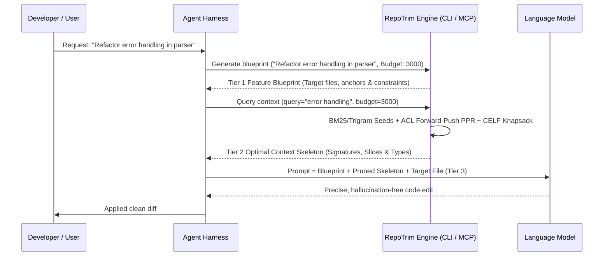

# RepoTrim Agent Harness Integration Overview

RepoTrim is designed from first principles to serve as a **high-efficiency context pruning engine for AI agent harnesses** (such as Antigravity, Claude Code, Cursor, OpenCode, SWE-bench runners, and custom autonomous agent loops).

---

## 1. The Context Efficiency Problem in Agent Harnesses

In typical autonomous agent workflows, the harness issues multiple iterations of LLM calls to plan, execute, and verify code changes. 

Without RepoTrim, an agent harness suffers from two major failure modes:
1. **Context Window Exhaustion:** Dumping whole files or broad directory trees rapidly consumes the 8k, 32k, or 128k context budget.
2. **"Lost in the Middle" Degradation:** LLM attention and code reasoning drop sharply when the prompt is diluted with thousands of lines of boilerplate and irrelevant implementations.

---

## 2. How RepoTrim Solves This in the Harness Loop

RepoTrim acts as the deterministic context filter sitting between the codebase and the LLM:

---

## 3. Core Capabilities for Harnesses

1. **Polyglot Cross-Language Multiplex Graph:**
   - Ingests **Rust**, **Python**, and **TypeScript / JavaScript** into a unified Code Property Graph connecting calls, type dependencies, and module containment.
2. **Automatic Intent & Diff Inference:**
   - Resolves natural language task descriptions (`--query "jwt token verification"`) via BM25 and trigram similarity.
   - Automatically maps git changes (`--from-diff`) directly to enclosing AST symbols for instant PR and code-review context.
3. **Turn-Key Agent Skill (`skills/repotrim/SKILL.md`):**
   - Implements the **3-Tier Context Funnel** (Blueprint $\to$ Skeleton $\to$ Active File) natively for Antigravity, Claude Code, Cursor, and OpenCode.
4. **Interactive Feature Blueprint Generator:**
   - Emits structured `FEATURE_BLUEPRINT.md` via `repotrim blueprint` CLI command or `generate_blueprint` MCP tool.
5. **Deterministic & Sub-Millisecond Speed:**
   - Evaluates in **< 1ms** via Andersen-Chung-Lang Forward-Push PPR and flat CSR matrix representation.
6. **Multi-Resolution Level of Detail (LOD):**
   - Active symbols receive full implementations or control-flow slices ($\text{LOD}_2$).
   - Dependencies receive clean signatures and docstrings ($\text{LOD}_1$ / $\text{LOD}_0$).
7. **Model Context Protocol (MCP) Integration:**
   - Exposes 5 standard JSON-RPC tools (`trim_context`, `query_graph_stats`, `inspect_symbol`, `clean_cache`, `generate_blueprint`) over `stdio`.
