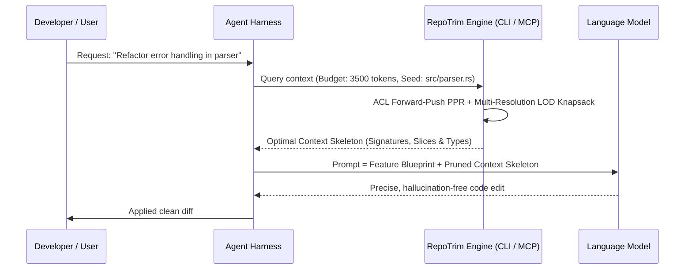

# RepoTrim Agent Harness Integration Overview

RepoTrim is designed from first principles to serve as a **high-efficiency context pruning engine for AI agent harnesses** (such as Antigravity, Claude Code, Cursor, OpenCode, SWE-bench runners, and custom autonomous agent loops).

---

## 1. The Context Efficiency Problem in Agent Harnesses

In typical autonomous agent workflows, the harness issues multiple iterations of LLM calls to plan, execute, and verify code changes. 

Without RepoTrim, an agent harness suffers from two major failure modes:
1. **Context Window Exhaustion:** Dumping whole files or broad directory trees rapidly consumes the 8k, 32k, or 128k context budget.
2. **"Lost in the Middle" Degradation:** LLM attention and code reasoning drop sharply when the prompt is diluted with thousands of lines of boilerplate and irrelevant implementations.

---

## 2. How RepoTrim Solves This in the Harness Loop

RepoTrim acts as the deterministic context filter sitting between the codebase and the LLM:

---

## 3. Core Capabilities for Harnesses

1. **Deterministic & Fast:**
   - Evaluates in **< 5ms** via Andersen-Chung-Lang Forward-Push PPR. No heavy compiler daemons or language servers required.
2. **Multi-Resolution Level of Detail (LOD):**
   - Active symbols receive full implementations or control-flow slices ($\text{LOD}_2$ / $\text{LOD}_3$).
   - Dependencies receive clean signatures and docstrings ($\text{LOD}_0$ / $\text{LOD}_1$).
3. **Seamless Scale Adaptation:**
   - **Small repos (500–5,000 LOC):** Naturally upgrades symbols to full bodies if the budget allows, providing lossless full context.
   - **Large monorepos (100k+ LOC):** Prunes 98%+ of irrelevant code, surfacing only the topologically relevant subgraph.
4. **Model Context Protocol (MCP) Support:**
   - Exposes standard JSON-RPC tools (`trim_context`, `query_graph_stats`, `inspect_symbol`, `clean_cache`) over `stdio` so any modern harness can call it natively.
